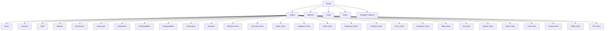

# Smog

Object layout and memory management for the Smog programming language.

Use go.dev's mermaid extension to render the diagram.

```mermaid
graph TD;
    A[Smog] --> B[Object];
    A --> C[Memory];
    A --> D[Heap];
    A --> E[Stack];
    A --> F[Garbage Collector];
    B --> G[Class];
    B --> H[Instance];
    B --> I[Field];
    B --> J[Method];
    B --> K[Constructor];
    B --> L[Destructor];
    B --> M[Inheritance];
    B --> N[Polymorphism];
    B --> O[Encapsulation];
    B --> P[Abstraction];
    B --> Q[Interface];
    B --> R[Abstract Class];
    B --> S[Concrete Class];
    B --> T[Static Class];
    B --> U[Singleton Class];
    B --> V[Value Class];
    B --> W[Reference Class];
    B --> X[Primitive Class];
    B --> Y[Array Class];
    B --> Z[Collection Class];
    B --> AA[Map Class];
    B --> AB[Set Class];
    B --> AC[Queue Class];
    B --> AD[Stack Class];
    B --> AE[Tree Class];
    B --> AF[Graph Class];
    B --> AG[Table Class];
    B --> AH[File Class];
```